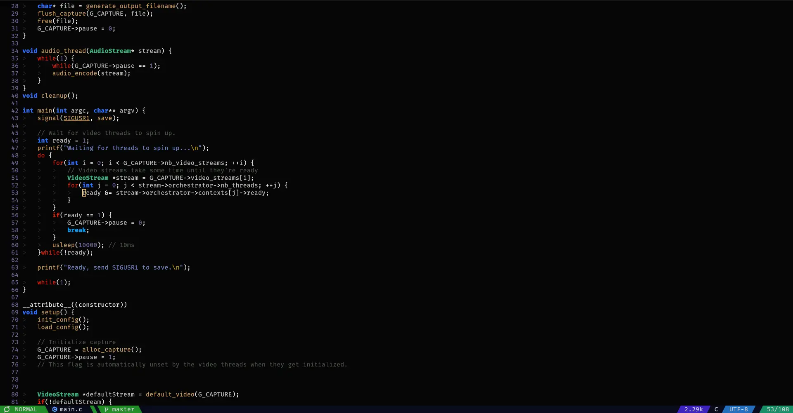
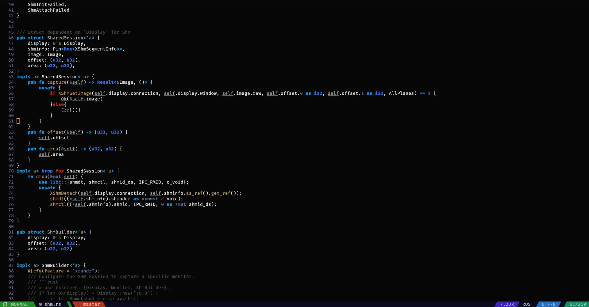

# cx.vim

My vim colorscheme.

## Installation

```bash
# vim
curl https://raw.githubusercontent.com/27justin/cx.vim/master/cx.vim > ~/.vim/colors/cx.vim
# for nvim
curl https://raw.githubusercontent.com/27justin/cx.vim/master/cx.vim > ~/.config/nvim/colors/cx.vim
# or anywhere else vim looks for colorschemes
```

Then, in vim/.rc:

```vim
colorscheme cx
```

# Screenshots




